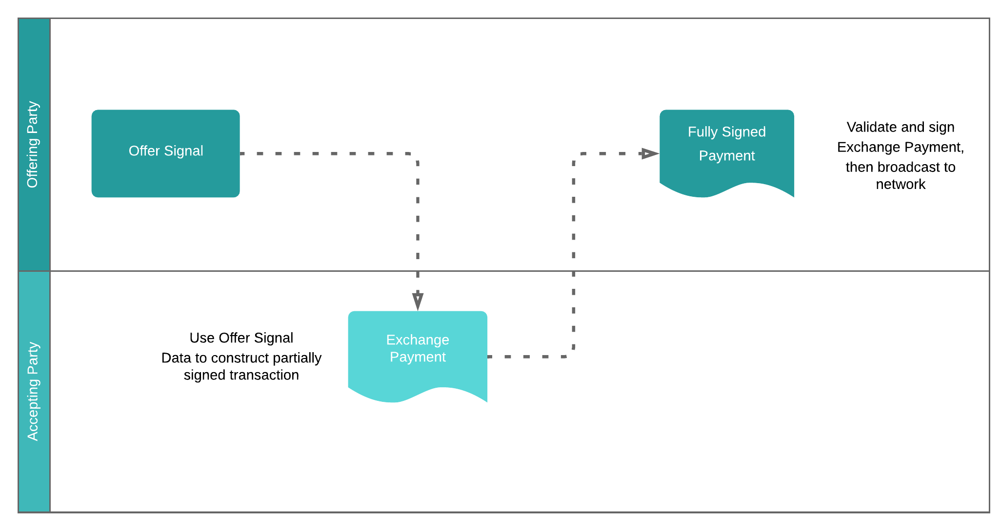
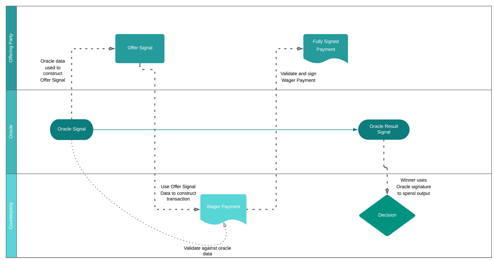
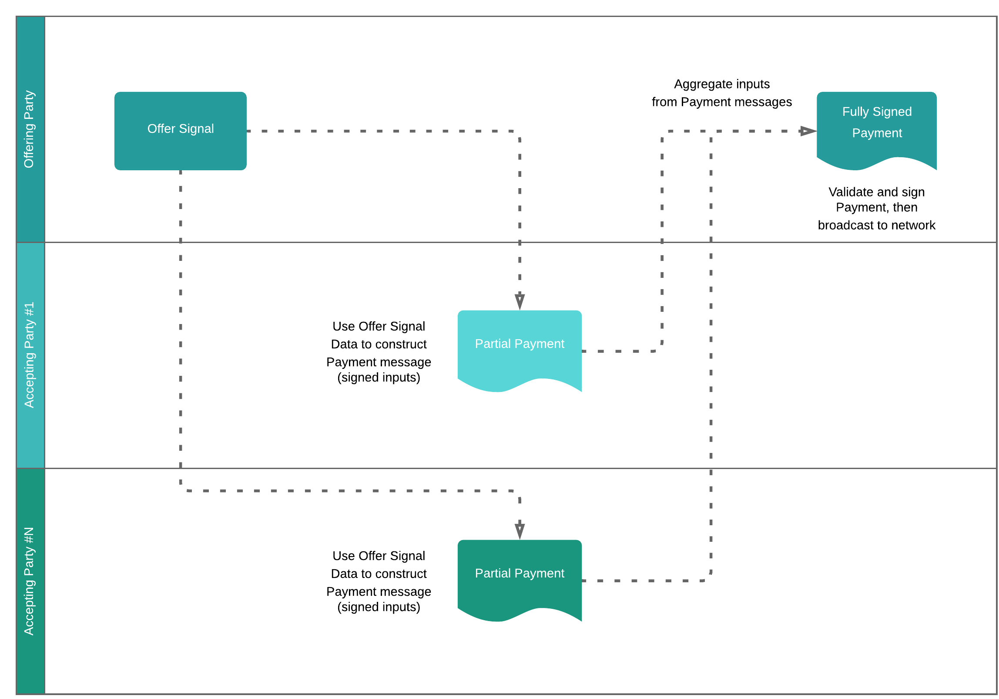

# Signal, Watch, and Pay Protocol Specification
### Specification version: 0.1
### Date published: May 7, 2020

## Author
Vin Armani

# 1. Background

## 1.1 Introduction

To allow value to be split and combined, Bitcoin transactions can contain multiple inputs and multiple outputs. While typically all of the inputs for a given transaction would be under the control of a single entity, this is not a requirement. Transactions are possible where even parties that have no knowledge of one another are able to “collaborate” by combining inputs. Until recently there have been few applications that required such collaboration between parties. The introduction of the Simple Ledger Protocol and advanced script functionality, such as OP_CHECKDATASIG, to Bitcoin Cash has opened up new applications where collaborative transactions have great utility and value.

We propose the Signal, Watch, and Pay (Swap) Protocol for on-chain communication between parties, allowing peer-to-peer, permissionless, trustless negotiation and execution of several classes of collaborative transactions.

## 1.2 Summary

The following presents a protocol for facilitating collaborative transactions between multiple parties using a blockchain-based messaging scheme. The motivation for this protocol was driven by the need for a fully peer-to-peer means of negotiating and executing collaborative transactions using only access to an active node.

The three types of collaborative transactions that this protocol enables are:

* **SLP Atomic Swaps** - Exchanges of Bitcoin Cash (BCH) satoshis for units of a given Simple Ledger Protocol token
* **Multi-Party Escrow** - Pay-To-Script-Hash outputs where spending is based on data broadcast, on-chain, by an oracle
* **Threshold Crowdfunding** - Trustless multi-input transactions that are only valid if the aggregate value of all submitted inputs are greater than a predefined output value

The protocol extends and adapts many concepts from the [Bitcoin Files Protocol](https://github.com/simpleledger/slp-specifications/blob/master/bitcoinfiles.md).

## 1.3 Collaborative Transactions

A “collaborative transaction” is defined as a transaction where multiple, independent parties contribute unique inputs to a single transaction. A collaborative transaction is distinct from a transaction which spends multi-signature (multisig) inputs because each party in a collaborative transaction is the sole “signer” of their respective input. Multisig inputs can be used in a collaborative transaction, but the group of signers of the multisig input would be considered a single party in this context.

## 1.4 Requirements

The SWaP Protocol was developed with the following requirements in mind

* ***Peer-To-Peer.*** No trusted third party should be required to enable communication between collaborating parties.
* ***Permissionless.*** There should be no limits on which network participants are able to participate in any given collaborative transaction.
* ***Trustless.*** Parties' funds should be secure and not subject to be spent other than in the manner intended by a given participant.
* ***Private.*** Participating in a collaborative transaction should have the same level of privacy as any other transaction.
* ***Recoverable.*** A user’s entire history of SWaP protocol activity should be recoverable, by that user’s wallet, given only a set of private keys.
* ***Non-Invasive.*** It should require no changes to the underlying Bitcoin Cash protocol.
* ***Extensible.*** The system should allow for new classes of collaborative transactions as the network evolves

# 2. Protocol

This protocol specification describes the requirements for handling the negotiation and execution of collaborative transactions using messages within the Bitcoin Cash blockchain. The sequence of actions taken by parties using the protocol are, generally, as follows:


1. Party #1 broadcasts a Signal message to the network indicating a desire to collaborate on a transaction.
2. Party #2 Watches the network for a desired Signal, constructs a partially-signed transaction which meets the requirements in the Signal message, and broadcasts the partially signed transaction in a Payment message to the network.
3. Party #1 Watches the blockchain for a Payment message that fulfills the requirements of the original Signal message, validates the partially-signed transaction in the Payment message, adds the remaining required signatures, and broadcasts the complete, valid transaction to the network.

## 2.1 Message Classes and Types

The Signal, Watch, and Pay (SWaP) message classes are used to represent different constructs in the communication protocol. In any SWP OP_RETURN message, the SWaP message type is represented by the required field named ```swp_msg_type```. There are currently two classes of messages: Signal and Payment. Each class contains several different types, representing the different types of collaborative transactions the protocol supports.

* `<swp_msg_class = 0x01>`: **A Signal**
  * `<swp_msg_type = 0x01>`: SLP Atomic Swap
  * `<swp_msg_type = 0x02>`: Multi-Party Escrow
  * `<swp_msg_type = 0x03>`: Threshold Crowdfunding<br><br>
* `<swp_msg_class = 0x02>`: **A Payment**
  * `<swp_msg_type = 0x01>`: SLP Atomic Swap
  * `<swp_msg_type = 0x02>`: Multi-Party Escrow
  * `<swp_msg_type = 0x03>`: Threshold Crowdfunding

### 2.1.1 Signal

A Signal is a message consisting of structured metadata within a single OP_RETURN output message located at output index 0 of a transaction. The format for the metadata must be followed exactly in order to be considered valid. The structured metadata format allows for indexing and searching of the blockchain for active Signals.

**SLP Atomic Swap (Type 1):** This Signal is broadcast by a party wishing to buy or sell a given token in exchange for BCH satoshis. The required format for the message is:
* ```OP_RETURN <lokad_id_int = 'SWP\x00'> <swp_msg_class = 0x01> <swp_msg_type = 0x01> <token_id_bytes> <BUY_or_SELL_ascii> <rate_in_sats_int> <proof_of_reserve_int> <exact_utxo_vout_hash_bytes> <exact_utxo_index_int> <minimum_sats_to_exchange_int>```

[Type 1 Example (ASM):](https://explorer.bitcoin.com/bch/tx/b03883ca0b106ea5e7113d6cbe46b9ec37ac6ba437214283de2d9cf2fbdc997f)

```OP_RETURN 53575000 01 01 4de69e374a8ed21cbddd47f2338cc0f479dc58daa2bbe11cd604ca488eca0ddf 53454c4c 0258 00 90dfb75fef5f07e384df4703b853a2741b8e6f3ef31ef8e5187a17fb107547f8 01 00```
		
**Multi-Party Escrow (Type 2):** This Signal is broadcast by a party wishing to find a counterparty to co-fund a P2SH script contract. The canonical application is multi-party escrow (such as wagering) using oracle data. The required format for the message is:
* ```OP_RETURN <lokad_id_int = 'SWP\x00'> <swp_msg_class = 0x01> <swp_msg_type = 0x02> <oracle_bfp_bytes> <contract_terms_index_int> <contract_party_index> <compiler_id_ascii> <compiler_contract_version_ascii> <pubkey_bytes> <exact_utxo_vout_hash_bytes> <exact_utxo_index_int> <appended_scriptPubKey_bytes*> <appended_sats_int*>```

[Type 2 Example (ASM):](https://explorer.bitcoin.com/bch/tx/d7cbeaab6d02769464f9c71a6efd8cd2682d728d7e5de3ac278372b1b81c9d83)

```OP_RETURN 53575000 01 02 974b3bf766b36434a21fe6f8782d8056f932d33ae401e92cf31a88204a21ea3e 00 01 6a65746f6e 653031 0299edb7a63380305c32b6fd54e09f7c2cbcf85b7182a691b065d8e5aff16ef61f 3757612cf36aae7cebaf71099139edd19e67cb5bdddc40514c38fe91341db5a6 01 76a91410c1db6f3076e020974ef540199e7ae4b76fbafa88ac 07d0```

***Threshold Crowdfunding (Type 3):*** This Signal is broadcast by a party wishing to fund a transaction with a given set of outputs by aggregating inputs from many parties. The required format for the message is:
* ```OP_RETURN <lokad_id_int = 'SWP\x00'> <swp_msg_class = 0x01> <swp_msg_type = 0x03> <campaign_uri_utf8> <out_count_and_outs_bytes>```

[Type 3 Example (ASM):](https://explorer.bitcoin.com/bch/tx/565c84990aacfbd006d4ed2ee14bfb0f3bb27a84a6c9adcabccb6fb8e17e64c5)

```OP_RETURN 53575000 01 03 68747470733a2f2f7377617063726f776466756e642e636f6d2f736f6d6563616d706169676e 02a0860100000000001976a914da74026d67264c0acfede38e8302704ef7d8cfb288acf0490200000000001976a914ac656e2dd5378ca9c45fd5cd44aa7da87c7bfa8288ac```

### 2.1.2 Payment

A Payment is a series of data chunks, representing a partially signed Bitcoin Cash transaction, encapsulated within OP_RETURN messages located at *vout=0* (the first output) in each data chunk’s respective transaction. The file chunks reference each other using the *vout=1* output as a pointer to the next data chunk. The transaction hash belonging to the final transaction made in the series of uploaded data chunks contains a special set of metadata parameters, including the number of chunks associated with the partially signed transaction data. This scheme is derived from the [Bitcoin Files Protocol](https://github.com/simpleledger/slp-specifications/blob/master/bitcoinfiles.md).

The metadata OP_RETURN messages for the various types of Payments are as follows:

**SLP Atomic Swap (Type 1):** This Payment contains the full data for a transaction, minus the signature(s) on the input(s) contributed by the party that initiated the corresponding Signal. The required format for the message is:
* ```OP_RETURN <lokad_id_int = 'SWP\x00'> <swp_msg_class = 0x02> <swp_msg_type = 0x01> <chunk_count_int> <signal_tx_id> <chunk_X_data_bytes>```<br><br>
	* ```<chunk_X_data_bytes>``` consists of the following data:
		1. The raw transaction data

**Multi-Party Escrow (Type 2):** This Payment contains the full data for a transaction, minus the signature(s) on the input(s) contributed by the party that initiated the corresponding Signal. For validation purposes, the ScriptPubKey of the script contract is also included in the metadata. The required format for the message is:
* ```OP_RETURN <lokad_id_int = 'SWP\x00'> <swp_msg_class = 0x02> <swp_msg_type = 0x02> <chunk_count_int> <signal_tx_id> <p2sh_scriptPubKey> <chunk_X_data_bytes>```<br><br>
	* ```<chunk_X_data_bytes>``` consists of the following data, concatenated:
		1. *uint32_t* (4 bytes) - The byte length of the P2SH subscript in (b)
		2. The P2SH subscript that must be included in the scriptSig when spending the escrow UTXO being created
		3. The raw transaction data

**Threshold Crowdfunding (Type 3):** This Payment contains only the data for signed Transaction Inputs (TxIns) precisely as would appear in a the raw data of a transaction spending to the outputs in the corresponding Signal. This represents the contribution, of the party making the Payment, to the crowdfunding campaign. The required format for the message is:
* ```OP_RETURN <lokad_id_int = 'SWP\x00'> <swp_msg_class = 0x02> <swp_msg_type = 0x03> <chunk_count_int> <signal_tx_id> <chunk_X_data_bytes>```<br><br>
	* ```<chunk_X_data_bytes>``` consists of the ordered and concatenated raw inputs data as described in [Section 3.3](#33-threshold-crowdfunding-type-3)

## 2.2 Oracle Signals

Multi-Party Escrow (Type 2) transactions will typically rely on data from an on-chain oracle to negotiate the initial contract and provide signatures and other data necessary to spend the contract UTXO(s). Oracles utilize the chained Bitcoin Files Protocol messages to publish both the Proposal and Result data used by the parties in Type 2 transactions. Oracle Signal data is in JSON format.

# 3. Process

## 3.1 SLP Atomic Swap (Type 1)



The procedure for negotiating and executing a BCH/SLP exchange via the SWaP protocol is as follows:

1. The Offering Party broadcasts a Signal with information about the desired exchange. This information includes:
	* ```<token_id_bytes>``` The SLP token ID
	* ```<BUY_or_SELL_ascii>``` Whether the Signal is an offer to BUY or SELL SLP tokens in exchange for BCH
	* ```<rate_in_sats_int>``` The offered exchange rate. This is the number of BCH satoshis to be exchanged for 1 unit of the SLP token
	* ```<proof_of_reserve_int>``` Whether or not the inputs of the Signal transaction should be used as [cryptographic proof of control over reserves](#43-proof-of-reserves) of either SLP tokens or BCH
	* ```<exact_utxo_vout_hash_bytes>``` The transaction hash of the UTXO being offered
	* ```<exact_utxo_index_int>``` The index (vout=n) of the UTXO being offered
	* ```<minimum_sats_to_exchange_int>``` The minimum value of the offered UTXO that can be exchanged. Any remaining funds should be sent back to the same address that currently contains the UTXO, as change


2. The Accepting Party finds the offered Signal, either by watching for Signals matching a certain pattern to be broadcast to the network (ie. *“Selling SPICE tokens at a rate less than or equal to X”*) or searching the blockchain for that pattern. Using the information in the Signal, the Accepting Party constructs a collaborative transaction, signs the inputs he is contributing, and broadcasts a Payment message, with the raw transaction of the partially-signed transaction as the attached data. The Payment message includes:
	* ```<chunk_count_int>``` The number of chained transactions representing “chunks” of attached data
	* ```<signal_tx_id>``` The transaction hex of the Signal being paid to
	* ```<chunk_X_data_bytes>``` The attached raw transaction data


3. The Offering Party watches for broadcast Payment messages for his originally offered Signal. Upon finding one, he downloads the partially signed transaction data and validates the transaction to be sure it fulfills the requirements of his original Signal. If the transaction is valid and meets the requirements, he
	* Signs his own inputs
	* Broadcasts the transaction to the blockchain
	* If the transaction is accepted, he spends the Baton UTXO from his original Signal, marking the Signal as spent.

## 3.2 Multi-Party Escrow (Type 2)



The procedure for negotiating and executing a two-party escrow transaction via the SWaP protocol is as follows:

1. The Offering Party broadcasts a Signal with information about the desired escrow contract. This information includes:
	* ```<oracle_bfp_bytes>``` The transaction hash of the Bitcoin Files Protocol transaction containing the oracle data
	* ```<contract_terms_index_int>``` The index of the “terms” object in the json object referenced by <oracle_bfp_bytes>
	* ```<contract_party_index>``` The index of the “party” in the object referenced by <contract_terms_index_int>. This is the side of the escrow that the Offering Party wishes to take.
	* ```<compiler_id_ascii>``` The standardized identifier for the script compiler upon which the contract terms object is based
	* ```<compiler_contract_version_ascii>``` The identifier for the particular contract template to be used by the script compiler
	* ```<pubkey_bytes>``` The Offering Party’s public key to be used in the escrow contract. This can coincide with the address to which the Signal has been sent, but that is not required.
	* ```<exact_utxo_vout_hash_bytes>``` The transaction hash of the UTXO being offered
	* ```<exact_utxo_index_int>``` The index (vout=n) of the UTXO being offered
	* ```<appended_scriptPubKey_bytes*>``` (optional) A scriptPubKey representing an additional required output address, such as an address for a fee output. (*Defaults to 0 if no additional output should be appended*)
	* ```<appended_sats_int*>``` (optional) A value representing the number of satoshis to be sent to the additional appended output. (*Defaults to 0 if no additional output should be appended*)

2. The Accepting Party finds the offered Signal, either by watching for Signals matching a certain pattern to be broadcast to the network (ie. *“Wagering on UFC Championship fight, taking the challenger to win, using jeton-lib compiler and the ee01 escrow template”*) or searching the blockchain for that pattern. Using the Signal parameters and Oracle data the Accepting Party crafts a partially signed transaction using the following procedure
	* Identify the specific compiler and template to be used to create the script contract
	* Construct the script contract using the Offering Party’s provided public key (in the Signal’s ```<pubkey_bytes>```) and the Accepting Party’s public key assigned to the appropriate contract parties
	* Begin construction of a transaction with the Offering Party’s offered UTXO (defined by ```<exact_utxo_vout_hash_bytes>``` and ```<exact_utxo_index_int>``` in the Signal) as the first input.
	* Add the P2SH escrow output derived from the script contract created in (b). Assign the value of the escrow output as twice the value of the offered UTXO minus half the value of ```<appended_sats_int>```:
		* ***2 * ( offered_utxo_value - ( <appended_sats_int> / 2 ) )***
	* Append additional output if the Signal includes ```<appended_scriptPubKey_bytes>``` and ```<appended_sats_int>```
	* Add additional inputs and change outputs necessary to make the transaction valid, though inputs have not been signed
Sign inputs contributed by Accepting Party
	* Broadcast a Payment message, with the raw transaction of the partially-signed transaction as the attached data. The Payment message includes:
		* ```<chunk_count_int>``` The number of chained transactions representing “chunks” of attached data
		* ```<signal_tx_id>``` The transaction hex of the Signal being paid to
		* ```<p2sh_scriptPubKey>```
		* ```<chunk_X_data_bytes>``` The attached data is concatenated bytes in the following order:
			* 32-bit Little Endian integer (4 bytes in length) representing the byte length of the subscript (script before hashing, used during spending on a P2SH input) which translates to ```<p2sh_scriptPubKey>```
			* The subscript data
			* The raw transaction data

3. The Offering Party finds the Payment message, either by watching for Payments with a <signal_tx_id> matching the transaction hash of the original offer Signal or by searching the blockchain for such Payment messages. Upon finding such a message, he downloads the partially signed transaction data and validates the transaction to be sure it fulfills the requirements of his original Signal. If the transaction is valid and meets the requirements, he
	* Signs his own inputs
	* Broadcasts the transaction to the blockchain
	* If the transaction is accepted, he spends the Baton UTXO from his original Signal, marking the Signal as spent.

## 3.3 Threshold Crowdfunding (Type 3)



The procedure for negotiating and executing a Threshold Crowdfund via the SWaP protocol is as follows:

1. The Offering Party broadcasts a Signal with information about the desired exchange. This information includes:
	* ```<campaign_uri_utf8>``` A URI for the crowdfunding campaign. This can be a web URI, and IPFS URI, a [Bitcoin Files Protocol](https://github.com/simpleledger/slp-specifications/blob/master/bitcoinfiles.md) URI, or any other valid informational URI. The URI prefix (if appropriate) should be included for disambiguation.
	* ```<out_count_and_outs_bytes>``` A representation of the output portion of the intended transaction. The format of this data is described at [https://bitcoin.org/en/developer-reference#raw-transaction-format](https://bitcoin.org/en/developer-reference#raw-transaction-format) and is as follows:
		* *compactSize uint* (varying byte length) - Number of outputs in this transaction.
		* *txOuts* (varying byte length) - Transaction outputs, concatenated. See description of txOut below.
			* *int64_t* (8 bytes) - Number of satoshis to spend. May be zero; the sum of all outputs may not exceed the sum of satoshis previously spent to the outpoints provided in the input section.
			* *compactSize uint* (1+ bytes) - Number of bytes in the pubkey script. Maximum is 10,000 bytes.
			* *char[]* (varying byte length) - The *scriptPubKey*. Defines the conditions which must be satisfied to spend this output.

2. The Accepting Party finds the offered Signal. In most cases, the Offering Party will publicize the offer as a means to attract funders. Using the output data in the Signal, the Accepting party constructs a set of signed inputs (to be used as a portion of the crowdfund) with the following procedure:
	* Create a new (Version 1) transaction with ```nLocktime=0``` and each input’s ```nSequence=UINT_MAX``` (```0xffffffff```)
	* Add the outputs as defined in the Offer Signal
	* Add the desired UTXOs to spend as inputs to spend and sign those inputs using ```SIGHASH_ALL|SIGHASH_ANYONECANPAY``` signature hash type.
	* Extract only the input data from the raw transaction in the following format:
		* *compactSize uint* (varying byte length) - Number of inputs in this transaction.
		* *txIns* (varying byte length) - Transaction inputs. See description of txIn below.
			* *outpoint* (36 bytes) - The previous outpoint being spent. See description of outpoint below.
				* *char[32]* (32 bytes) - The TXID of the transaction holding the output to spend. The TXID is a hash provided in internal byte order.
				* *uint32_t* (4 bytes) - The output index number of the specific output to spend from the transaction. The first output is ```0x00000000```.
			* *compactSize uint* (varying byte length) - The number of bytes in the signature script. Maximum is 10,000 bytes.
			* *char[]* (varying byte length) - scriptSig. A script-language script which satisfies the conditions placed in the outpoint’s pubkey script.
			* *Uint32_t* (4 bytes) - Sequence value. Must be set as ```0xffffffff```
	* Broadcast the Payment message. The Payment message includes:
		* ```<chunk_count_int>``` The number of chained transactions representing “chunks” of attached data
		* ```<signal_tx_id>``` The transaction hex of the crowdfund Offer Signal being paid to
		* ```<chunk_X_data_bytes>``` The extracted input data from (d)

3. The Offering Party aggregates all Payment messages by searching the blockchain for Payments which correspond to the original ```<signal_tx_id>```. Upon aggregating sufficient valid Payments, the Offering Party constructs a valid transaction using the outputs from the original Offer Signal and the inputs from the Payments. The Offering Party then broadcasts this transaction to the network. If the transaction is accepted, he spends the **Baton UTXO** from his original Signal, marking the Signal as spent.

# 4. Considerations

## 4.1 Completing or Canceling An Offer Signal
A Signal is considered active (accepting Payments) as long as its **“Baton UTXO”** - the UTXO at index 1 (the second output) - is unspent. Upon successful completion and execution of a SWaP protocol transaction, or if the Offering Party wishes to cancel the Offer, said party simply spends the Baton UTXO.
New Payments must never be sent for a completed or cancelled Offer Signal and any wallets supporting SWaP Protocol must make this check on any prospective Offers.

## 4.2 Reserving UTXOs
A signed input in a Payment message has not actually been spent. It’s associated UTXO is still available to be spent in another transaction. Such spending would render the Payment message invalid and unusable. Wallets implementing the SWaP Protocol must implement a procedure for reserving (quarantining) UTXOs in pending Payments.
In all cases, wallets should regularly check to see if the baton UTXO for the associated Offer Signal has been spent. If it has, then the Offer has been closed and any UTXOs being held in reserve can be released to the spendable pool in the user’s wallet.

In the case of Type 1 (exchange) and Type 2 (escrow) Payments, the length of time required for this reserve should be no longer than a matter of minutes, as such transactions should settle quickly. Wallets should allow removal from quarantine by manual user action. This effectively “cancels” the pending Payment.

In the case of a Type 3 (crowdfund) Payment, the end date for the campaign should be specified in the data at the ```<campaign_uri_utf8>``` defined in the Offer Signal. For Type 3 Payments, the reserve time should be indeterminate, and wallets should only allow removal from quarantine by manual user action or if the Signal is spent.
To effectively “cancel” a pending Payment, the Accepting Party need only spend the UTXO(s) being used as an input in the Payment message.

## 4.3 Proof Of Reserves
A valid, signed Bitcoin input represents proof of control over the value in the address (scriptPubKey) associated with the signature (scriptSig) of an input being "spent from" that address. This fact is fundamental to the very nature of Bitcoin. This cryptographic proof can be leveraged by the party making an Exchange (Type 1) Offer Signal to demonstrate control over any amount of funds. The Offering Party can do this simply by spending a single, small (dust) input from any number of addresses in the Signal transaction.

If ```<proof_of_reserve_int = 0x01>``` and ``<exact_utxo_vout_hash_bytes = 0x00>`` in an Exchange Offer Signal, then the Offering Party is communicating an "open offer" and making all UTXOs in the reserves available. Those wishing to spend from those reserve UTXOs should begin from the address associated with the input at index 0 of the Signal transaction when building their Payment. If UTXOs are no longer available from that address, then the Accepting Party should proceed through the reserve addresses in the order of the inputs in the Offer Signal.

The proof of reserves functionality represents an "open window" and, as such, allows for applications such as [fixed exchange rate (pegged) currencies and stablecoins](https://en.wikipedia.org/wiki/Fixed_exchange_rate_system).

## 4.4 Payment Message Encryption
The final, valid transaction which executes an exchange will, necessarily, make public the inputs and outputs of all parties. However, some payment messages will inevitably be cancelled or otherwise not accepted and executed in a final transaction. In the case of such "unredeemed" payments, the party constructing the Payment message (with valid signatures on inputs) has reduced their privacy somewhat by displaying control of a set of UTXOs. As such, Accepting Parties have some incentive to encrypt their payment message such that only the Offering Party can read it. [Elliptic Curve Integrated Encryption Schemes (ECIES)](https://en.wikipedia.org/wiki/Integrated_Encryption_Scheme) is a natural fit for encryption as it can use native Bitcoin keypairs. Any scheme which can utilize Bitcoin keypairs for the encryption and decryption is viable. This specification does not specifically address encryption, but clients can support any scheme they see fit.

## Reference Implementations

### Clients
None currently

### Libraries
[swap-bch-js](https://github.com/vinarmani/swap-bch-js)
